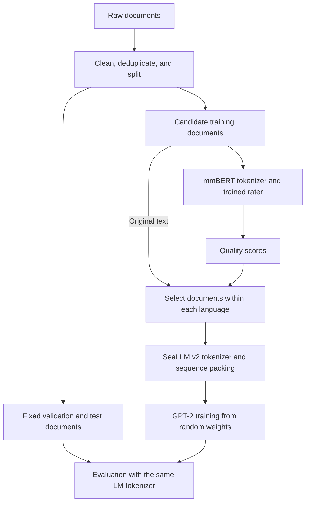

# Pilot guide: document selection and GPT-2 training from scratch

This guide explains how to use your multilingual rater to select documents, train a small GPT-2-style language model, and evaluate whether the selection helps.

The pilot is a workflow check and an initial comparison. A 5,000-document experiment alone cannot establish that a filtering method will improve large-scale pretraining. This guide contains proposed settings and illustrative code; no model training or corpus audit has been performed for this document.

## The tokenizer decision

| Component | Model | Tokenizer | Training objective |
| --- | --- | --- | --- |
| Quality rater | Pretrained mmBERT with regression heads | `jhu-clsp/mmBERT-base` | MSE against human quality ratings |
| Pilot language model | Small GPT-2 architecture with random weights | `SeaLLMs/SeaLLM-7B-v2` | Next-token cross-entropy |

Keep the mmBERT checkpoint's tokenizer when training and applying the rater. mmBERT uses a Gemma 2 tokenizer with a 256,000-entry vocabulary. Its pretrained embeddings depend on the existing token-to-ID mapping. [mmBERT model card](https://huggingface.co/jhu-clsp/mmBERT-base)

For GPT-2, start with the SeaLLM v2 tokenizer, subject to the audit in Step 4. The checkpoint specifies a vocabulary size of 48,384, which makes the embedding and output layers smaller than using mmBERT's vocabulary at the same hidden size. This is a practical starting choice, not a measured claim that it is best for your corpus. [SeaLLM v2 configuration](https://huggingface.co/SeaLLMs/SeaLLM-7B-v2/blob/main/config.json)

Loading this tokenizer does not load SeaLLM's 7B model. All GPT-2 weights will start randomly initialized.

### What the tokenizer does

A tokenizer splits text into tokens and maps them to integer IDs. Tokens can represent words, word pieces, punctuation, or smaller units. The model's embedding layer converts those IDs into vectors. The tokenizer itself does not assign document-quality scores.

The two models can use different tokenizers because the information passed between stages is the original document text and its quality scores. Do not pass mmBERT token IDs or embeddings into GPT-2.

## Overall data flow



Train and validate the rater before using its predictions for selection. Steps 3 and 4 can be prepared independently after the corpus splits are defined.

## Step 1 — Record the pilot settings

Create an experiment configuration before processing data. Record:

- Pilot document count and whether 5,000 means total or per language.
- Included languages, source/domain proportions, and sampling seed.
- Rater checkpoint, annotated dimensions, and score aggregation rule.
- Exact tokenizer revisions, model settings, and software versions.
- Token budget for each language and total training-token budget.
- Validation protocol and checkpoint-selection rule.

For the numerical examples below, assume **5,000 cleaned documents total**. If your intended budget is 5,000 per language, apply the same procedure within each language. The example does not change your chosen pilot scope.

Count documents and tokens separately: equal document counts can contain very different amounts of training text.

**Output:** an experiment configuration and a corpus inventory by language.

## Step 2 — Prepare data and reserve evaluation splits

1. Assign stable document IDs and retain original text, language, source/domain, and provenance.
2. Remove empty records, extraction failures, and obvious repeated boilerplate. Preserve meaningful accents, script characters, and code-switching.
3. Identify exact and near duplicates. Keep related documents in the same split; use source-group splits where needed to prevent near-identical pages crossing splits.
4. Reserve validation and test documents before applying quality-based selection. Stratify by language and, where feasible, source/domain.
5. Keep downstream benchmark documents out of training. Also exclude rater-supervision documents and their duplicates from LM validation/test where possible, to avoid evaluation feedback through the selector.

An illustrative split for 5,000 cleaned documents is:

| Split | Approximate documents | Use |
| --- | ---: | --- |
| Candidate training pool | 4,000 | Source pool for every selection method |
| Validation | 500 | Monitor training and choose settings/checkpoints |
| Test | 500 | Final comparison after settings are fixed |

Grouping constraints can change the exact counts. Ensure every language has enough held-out documents to support a useful comparison.

Use the same validation/test sets for every experiment. Do not select a different high-quality test set for each method.

If the rater still needs human annotation, allow time for document preparation, sampling, annotation instructions, and quality checks before annotation begins. Keep rater training/validation/test partitions distinct from one another.

**Output:** fixed document manifests for the training pool, validation, and test splits.

## Step 3 — Train and validate the mmBERT rater

If you already have a validated rater, reuse it and record its checkpoint.

For the frozen-encoder setup:

1. Load pretrained mmBERT and its matching tokenizer.
2. Freeze the encoder weights. Keep the frozen encoder in evaluation mode when producing fixed representations.
3. Convert each annotated document to a representation using a defined pooling method, excluding padding from any mean pooling.
4. Train one regression output per annotated quality dimension.
5. Use the original human-average ratings on the 0–5 scale as continuous targets; retain fractional values.
6. Optimize mean squared error. If some labels are missing, exclude them from the loss.
7. Validate per language and dimension using MAE, Spearman correlation, and prediction bias. Compare against a constant training-mean predictor.

Use the same text preprocessing, pooling, and length policy at scoring time. For long documents, explicitly record whether the rater truncates or combines chunk predictions; do not silently change this policy after training.

For this pilot, keep z-score normalization as an analysis tool unless you explicitly define a separate normalization experiment. Clipping predictions to 0–5 for selection is a possible fixed postprocessing rule; record it and inspect whether it creates many tied scores.

**Output:** a rater checkpoint, tokenizer, preprocessing configuration, and per-language validation results.

## Step 4 — Load and audit the language-model tokenizer

Load the two tokenizers separately:

```python
from transformers import AutoTokenizer

rater_tokenizer = AutoTokenizer.from_pretrained("jhu-clsp/mmBERT-base")
lm_tokenizer = AutoTokenizer.from_pretrained("SeaLLMs/SeaLLM-7B-v2")

# Pilot convention: right padding, reusing EOS as the padding ID.
# The attention mask will distinguish padding from real EOS tokens.
lm_tokenizer.padding_side = "right"
lm_tokenizer.pad_token = lm_tokenizer.eos_token
```

Pin the resolved checkpoint revisions and save the tokenizer files with your experiment. The calls above use the repository's current default revision for readability.

Audit a small, representative sample from each language, drawn from the training pool. For example, inspect 50–100 documents per language when available. Check:

- Unknown-token frequency and unusual character handling.
- Token counts per document, including upper percentiles.
- Tokens per Unicode character, compared between candidate tokenizers **within the same language**.
- Whether scripts, accents, punctuation, and code-switching survive encoding/decoding as expected; document intentional normalization.
- How often documents exceed the planned context length.

Use whitespace-based tokens-per-word measurements only where word segmentation makes them meaningful. Zero unknown tokens alone does not establish efficient tokenization.

If the audit reveals serious fragmentation or text loss in a target language, resolve it before the main runs. A custom multilingual tokenizer remains a possible later experiment. Once chosen, freeze the LM tokenizer for all selection methods.

SeaLLM v2's saved settings automatically add BOS and do not automatically add EOS. This guide instead controls document boundaries explicitly in Step 6. [Tokenizer configuration](https://huggingface.co/SeaLLMs/SeaLLM-7B-v2/blob/main/tokenizer_config.json)

**Output:** a tokenizer audit by language and a saved, fixed LM tokenizer.

## Step 5 — Score the candidate pool and construct comparison sets

Run the trained rater on candidate training documents using its mmBERT tokenizer. Preserve the original text and save the predicted score for every dimension.

Also tokenize/count documents with the **LM tokenizer**, using the same boundary-token convention as training. Rater token counts must not determine GPT-2's training budget.

Begin with these comparison methods:

| Method | Document ordering within each language |
| --- | --- |
| Random | Seeded random order |
| One-dimension baseline | Highest score on a preselected dimension, such as Educational Value if annotated |
| Combined score | Highest equal-weight mean across the annotated dimensions |

The combined score is an initial baseline. It is not evidence that every dimension deserves equal weight. Validate rater bias before introducing more complex selection weights.

Set the same selected-token budget for each method in each language. An initial retention target could be about half the candidate pool's tokens per language; this is an example setting. Selecting every document would make these methods identical as data-selection experiments.

One practical budgeting procedure is to accumulate ranked documents until reaching each language's token target, retaining the final whole document in the manifest. Shuffle and pack with a fixed policy, then cap the consumed stream at the target. Record any partially consumed document. Keep the same rounding, packing, and boundary policy across methods.

Save selected document IDs, scores, language counts, source proportions, and consumed token counts. Inspect whether filtering systematically excludes particular languages, domains, or code-switched text.

**Output:** one selected-data manifest per method, with matched language/token budgets.

## Step 6 — Build GPT-2 training sequences

Use selected original text as input to the LM tokenizer. For this pilot, encode ordinary text without a chat template and append one end-of-document token:

```python
def encode_document(text):
    ids = lm_tokenizer.encode(text, add_special_tokens=False)
    return ids + [lm_tokenizer.eos_token_id]
```

Shuffle documents with a recorded seed, concatenate the encoded documents, and split the stream into sequences of up to 1,024 tokens. For explicit language-budget accounting, pack per-language streams before mixing their batches. Preserve the final partial block with padding, or record any dropped tokens under a fixed rule.

EOS marks a document boundary; it does not itself prevent attention across documents within a packed sequence. Ordinary causal packing is an acceptable pilot convention if shared by all runs.

For next-token labels, copy the input IDs and mask actual padding positions. Keep genuine EOS tokens as prediction targets. [Causal language-modeling guide](https://huggingface.co/docs/transformers/en/tasks/language_modeling)

```python
# batch contains tensors produced by your packing/padding code.
labels = batch["input_ids"].clone()
labels[batch["attention_mask"] == 0] = -100
```

Because this guide shares the EOS and padding ID, do not mask every occurrence of that ID. Use the attention mask. Do not blindly use a collator that removes all EOS-ID targets.

**Output:** packed training batches, plus fixed evaluation inputs and masks.

## Step 7 — Initialize a small GPT-2 model from scratch

This is a proposed pilot architecture, not the pretrained GPT-2 checkpoint:

```python
from transformers import GPT2Config, GPT2LMHeadModel, set_seed

set_seed(42)

config = GPT2Config(
    vocab_size=len(lm_tokenizer),
    n_positions=1024,
    n_embd=512,
    n_layer=6,
    n_head=8,
    bos_token_id=lm_tokenizer.bos_token_id,
    eos_token_id=lm_tokenizer.eos_token_id,
    pad_token_id=lm_tokenizer.pad_token_id,
    tie_word_embeddings=True,
    use_cache=False,
)

model = GPT2LMHeadModel(config)
```

Constructing the model from a configuration initializes random weights. Match the vocabulary size and special-token IDs to the loaded tokenizer. [GPT-2 configuration and model documentation](https://huggingface.co/docs/transformers/en/model_doc/gpt2)

For each comparison seed, save one initial model state and start every selection method from that state with a fresh optimizer. Never continue training the previous method's model.

**Output:** a model configuration and shared initial checkpoint for each seed.

## Step 8 — Train with next-token cross-entropy

The rater's targets are human quality scores. GPT-2's targets are the next tokens in the selected text. Quality scores determine document selection; they are not GPT-2 prediction labels.

```python
outputs = model(
    input_ids=batch["input_ids"],
    attention_mask=batch["attention_mask"],
    labels=labels,
)
loss = outputs.loss
```

Hugging Face's GPT-2 language-model head shifts labels internally and ignores `-100` labels. Do not shift these labels again before passing them to the model. [GPT-2 forward documentation](https://huggingface.co/docs/transformers/en/model_doc/gpt2#transformers.GPT2LMHeadModel.forward)

Suggested initial training settings, to validate in a short preliminary run:

| Setting | Starting point |
| --- | --- |
| Optimizer | AdamW |
| Learning rate | `3e-4` |
| Weight decay | `0.1` |
| Warmup | First 5% of optimizer steps |
| Schedule | Cosine decay after warmup |
| Gradient clipping | Norm `1.0` |
| Effective batch | Start around 8 sequences of 1,024 tokens; use accumulation if needed |
| Precision | BF16 if supported; otherwise choose supported precision |
| Run length | Predetermine an equal processed-token budget for all methods |

These are proposed defaults, not settings demonstrated to be optimal on your data or hardware. Select a stable shared recipe before the comparison runs.

First run a small check that verifies valid token IDs, finite loss, correct padding masks, and loss reduction on a repeated tiny batch. Then run the full pilot comparison.

Log training/validation loss, learning rate, consumed non-padding tokens, repeated-data exposure, throughput, and peak memory. Evaluate at matching token intervals. Keep architecture, initialization, optimizer, batch settings, language mixture, and total processed tokens fixed across methods.

One paired seed is sufficient for checking the workflow. Repeat promising comparisons with at least three paired seeds before interpreting a small difference as reliable.

**Output:** checkpoints and training logs for each selection method.

## Step 9 — Evaluate on fixed held-out text

Use the saved LM tokenizer, identical context handling, and the same evaluation documents for every model. Run evaluation with dropout disabled and without gradient updates.

For each language, report next-token cross-entropy and perplexity:

```text
mean loss = total negative log-likelihood / number of scored target tokens
perplexity = exp(mean loss)
```

Count targets after the causal shift and exclude padding or intentionally masked context. Weight batch losses by their scored-token counts rather than averaging unequal batches equally.

Lower perplexity means the model assigns higher probability to the held-out token sequence. Perplexity is comparable across selection methods only with the same tokenizer, evaluation text, and scoring protocol. A fixed sliding-window protocol can provide more context than disjoint blocks; score each eligible target once. [Perplexity documentation](https://huggingface.co/docs/transformers/en/perplexity)

Report:

- Loss and perplexity separately for every language.
- Macro-average loss, giving each language equal weight.
- Worst-language change relative to the Random baseline, alongside all per-language changes.
- Variation across seeds when available.

Avoid treating absolute perplexity differences between languages as a direct measure of language fairness: tokenization and text distributions differ. Compare each method against the baseline within each language.

Use validation data to choose settings/checkpoints. After choices are fixed, evaluate on the test set. Report the matched final-budget checkpoint as the main controlled comparison; any best-validation-checkpoint results should include the tokens consumed at that checkpoint.

No downstream fine-tuning is required for language-model loss or perplexity. A later supervised downstream experiment needs a separate task-training split, the same fine-tuning recipe for each pretrained model, and an untouched task test set. Zero-shot or few-shot evaluation leaves model weights unchanged.

**Output:** a per-language comparison table and training/validation curves.

## Step 10 — Decide whether to scale the experiment

Check whether the pilot demonstrates:

- Reliable tokenization and scoring for every target language.
- A rater that improves on simple prediction baselines.
- Genuine differences between the selected document sets.
- Stable GPT-2 training under matched budgets.
- A held-out improvement that is not explained only by a change in language proportions, domain mixture, or training exposure.

Treat the filtering result as preliminary if differences are small, inconsistent across languages, or based on one seed. More documents, more training tokens, and repeated runs are needed to assess larger-scale effectiveness. Repeating a tiny corpus for more epochs does not provide additional unique data.

## Files to retain for reproducibility

| Artifact | What it records |
| --- | --- |
| Experiment configuration | Scope, languages, model recipe, seeds, budgets, versions |
| Split manifests | Document IDs, provenance, duplicate groups, split assignment |
| Rater checkpoint and report | Scoring model, preprocessing, per-language accuracy |
| Tokenizer files and audit | Exact mapping, special tokens, language-specific checks |
| Scored document manifest | Original text reference and predicted dimensions |
| Selection manifests | Method, selected IDs, consumed language/token counts |
| LM checkpoints and logs | Initial/trained weights, optimizer state, training exposure |
| Evaluation results | Shared evaluation protocol, per-language metrics, seed variation |

## Execution checklist

- [ ] Record the 5,000-document scope and language allocation.
- [ ] Clean, deduplicate, and freeze data splits.
- [ ] Train or validate the mmBERT rater using its own tokenizer.
- [ ] Audit and freeze the SeaLLM v2 tokenizer for GPT-2.
- [ ] Score candidate documents and count LM tokens.
- [ ] Build Random and quality-based subsets under matched budgets.
- [ ] Encode original text, add document boundaries, and pack sequences.
- [ ] Initialize identical GPT-2 weights for each paired comparison.
- [ ] Run a short correctness check, then the training comparisons.
- [ ] Evaluate fixed validation/test text and report every language.
- [ ] Save the artifacts needed to reproduce the result.
